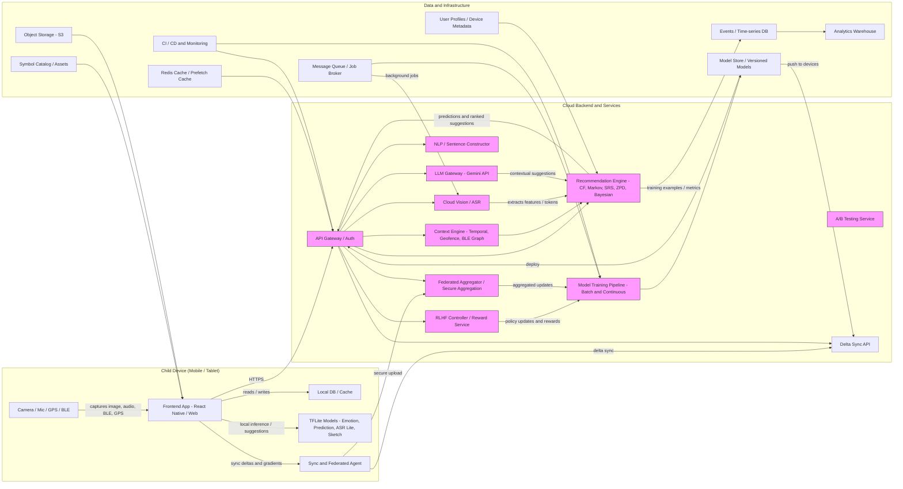

## System Architecture

```mermaid
graph LR

  subgraph DEVICE["Child Device (Mobile / Tablet)"]
    App["Frontend App - React Native / Web"]
    LocalDB["Local DB / Cache"]
    OnDeviceML["TFLite Models - Emotion, Prediction, ASR Lite, Sketch"]
    Sensors["Camera / Mic / GPS / BLE"]
    SyncClient["Sync and Federated Agent"]
  end

  subgraph CLOUD["Cloud Backend and Services"]
    APIGW["API Gateway / Auth"]
    ContextEng["Context Engine - Temporal, Geofence, BLE Graph"]
    RecoEngine["Recommendation Engine - CF, Markov, SRS, ZPD, Bayesian"]
    NLP["NLP / Sentence Constructor"]
    LLM["LLM Gateway - Gemini API"]
    VisionASR["Cloud Vision / ASR"]
    RLHF["RLHF Controller / Reward Service"]
    FederatedAgg["Federated Aggregator / Secure Aggregation"]
    Training["Model Training Pipeline - Batch and Continuous"]
    ABTest["A/B Testing Service"]
    SyncAPI["Delta Sync API"]
  end

  subgraph DATA["Data and Infrastructure"]
    Events["Events / Time-series DB"]
    Profiles["User Profiles / Device Metadata"]
    Symbols["Symbol Catalog / Assets"]
    ObjectStore["Object Storage - S3"]
    Models["Model Store / Versioned Models"]
    Analytics["Analytics Warehouse"]
    Cache["Redis Cache / Prefetch Cache"]
    Queue["Message Queue / Job Broker"]
    CI_CD["CI / CD and Monitoring"]
  end

  Sensors -->|"captures image, audio, BLE, GPS"| App
  App -->|"local inference / suggestions"| OnDeviceML
  App -->|"reads / writes"| LocalDB
  App -->|"HTTPS"| APIGW
  App -->|"sync deltas and gradients"| SyncClient

  SyncClient -->|"secure upload"| FederatedAgg
  SyncClient -->|"delta sync"| SyncAPI

  APIGW --> ContextEng
  APIGW --> RecoEngine
  APIGW --> NLP
  APIGW --> LLM
  APIGW --> VisionASR
  APIGW --> FederatedAgg
  APIGW --> RLHF
  APIGW --> SyncAPI

  ContextEng --> RecoEngine

  RecoEngine -->|"predictions and ranked suggestions"| APIGW
  RecoEngine -->|"training examples / metrics"| Events

  VisionASR -->|"extracts features / tokens"| RecoEngine
  LLM -->|"contextual suggestions"| RecoEngine

  RLHF -->|"policy updates and rewards"| Training
  FederatedAgg -->|"aggregated updates"| Training

  Training --> Models
  Models -->|"deploy"| APIGW
  Models -->|"push to devices"| SyncAPI

  Events --> Analytics
  Profiles --> RecoEngine
  Symbols --> App
  ObjectStore --> App
  Cache --> APIGW
  Queue --> Training
  Queue -->|"background jobs"| VisionASR

  CI_CD --> APIGW
  CI_CD --> Training

  classDef service fill:#f9f,stroke:#333,stroke-width:1px;
  class APIGW,ContextEng,RecoEngine,NLP,LLM,VisionASR,RLHF,FederatedAgg,Training,ABTest service;
```
