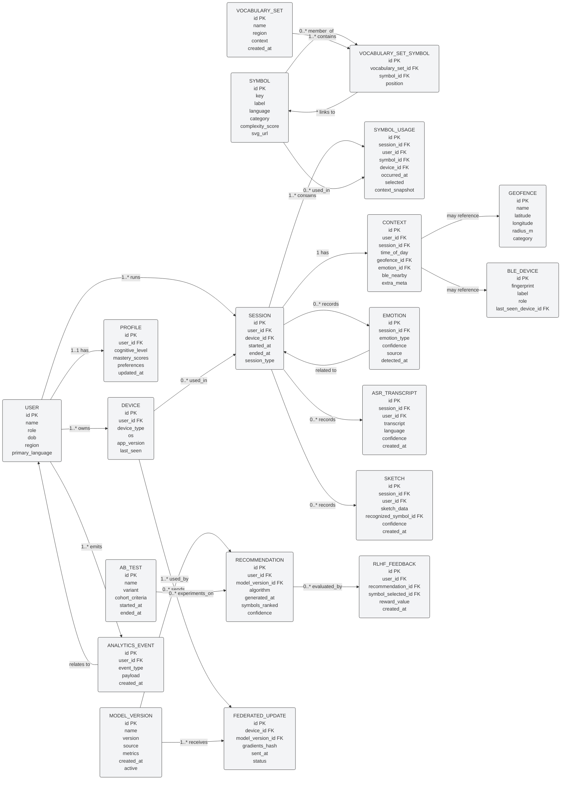

# ER

```mermaid
graph LR
  %% Entities with key fields
  USER["USER\nid PK\nname\nrole\ndob\nregion\nprimary_language"]
  DEVICE["DEVICE\nid PK\nuser_id FK\ndevice_type\nos\napp_version\nlast_seen"]
  PROFILE["PROFILE\nid PK\nuser_id FK\ncognitive_level\nmastery_scores\npreferences\nupdated_at"]
  SYMBOL["SYMBOL\nid PK\nkey\nlabel\nlanguage\ncategory\ncomplexity_score\nsvg_url"]
  VOCAB_SET["VOCABULARY_SET\nid PK\nname\nregion\ncontext\ncreated_at"]
  VOCAB_MEM["VOCABULARY_SET_SYMBOL\nid PK\nvocabulary_set_id FK\nsymbol_id FK\nposition"]
  SESSION["SESSION\nid PK\nuser_id FK\ndevice_id FK\nstarted_at\nended_at\nsession_type"]
  USAGE["SYMBOL_USAGE\nid PK\nsession_id FK\nuser_id FK\nsymbol_id FK\ndevice_id FK\noccurred_at\nselected\ncontext_snapshot"]
  CONTEXT["CONTEXT\nid PK\nuser_id FK\nsession_id FK\ntime_of_day\ngeofence_id FK\nemotion_id FK\nble_nearby\nextra_meta"]
  GEOFENCE["GEOFENCE\nid PK\nname\nlatitude\nlongitude\nradius_m\ncategory"]
  BLE["BLE_DEVICE\nid PK\nfingerprint\nlabel\nrole\nlast_seen_device_id FK"]
  EMOTION["EMOTION\nid PK\nsession_id FK\nemotion_type\nconfidence\nsource\ndetected_at"]
  ASR["ASR_TRANSCRIPT\nid PK\nsession_id FK\nuser_id FK\ntranscript\nlanguage\nconfidence\ncreated_at"]
  SKETCH["SKETCH\nid PK\nsession_id FK\nuser_id FK\nsketch_data\nrecognized_symbol_id FK\nconfidence\ncreated_at"]
  RECO["RECOMMENDATION\nid PK\nuser_id FK\nmodel_version_id FK\nalgorithm\ngenerated_at\nsymbols_ranked\nconfidence"]
  MODEL["MODEL_VERSION\nid PK\nname\nversion\nsource\nmetrics\ncreated_at\nactive"]
  FED["FEDERATED_UPDATE\nid PK\ndevice_id FK\nmodel_version_id FK\ngradients_hash\nsent_at\nstatus"]
  RLHF["RLHF_FEEDBACK\nid PK\nuser_id FK\nrecommendation_id FK\nsymbol_selected_id FK\nreward_value\ncreated_at"]
  AB["AB_TEST\nid PK\nname\nvariant\ncohort_criteria\nstarted_at\nended_at"]
  ANALYT["ANALYTICS_EVENT\nid PK\nuser_id FK\nevent_type\npayload\ncreated_at"]

  %% Relationships (label shows role / cardinality)
  USER -->|1..* owns| DEVICE
  USER -->|1..1 has| PROFILE
  USER -->|1..* runs| SESSION
  USER -->|1..* emits| ANALYT

  DEVICE -->|0..* used_in| SESSION
  DEVICE -->|0..* sends| FED

  SESSION -->|1..* contains| USAGE
  SESSION -->|1 has| CONTEXT
  SESSION -->|0..* records| EMOTION
  SESSION -->|0..* records| ASR
  SESSION -->|0..* records| SKETCH

  SYMBOL -->|0..* used_in| USAGE
  SYMBOL -->|0..* member_of| VOCAB_MEM

  VOCAB_SET -->|1..* contains| VOCAB_MEM
  VOCAB_MEM -->|* links to| SYMBOL

  CONTEXT -->|may reference| GEOFENCE
  CONTEXT -->|may reference| BLE
  EMOTION -->|related to| SESSION

  MODEL -->|1..* used_by| RECO
  MODEL -->|1..* receives| FED

  RECO -->|0..* evaluated_by| RLHF
  AB -->|0..* experiments_on| RECO

  ANALYT -->|relates to| USER

  %% Styling
  classDef entity fill:#f3f4f6,stroke:#333,stroke-width:1px,rx:4,ry:4;
  class USER,DEVICE,PROFILE,SYMBOL,VOCAB_SET,VOCAB_MEM,SESSION,USAGE,CONTEXT,GEOFENCE,BLE,EMOTION,ASR,SKETCH,RECO,MODEL,FED,RLHF,AB,ANALYT entity;
```
