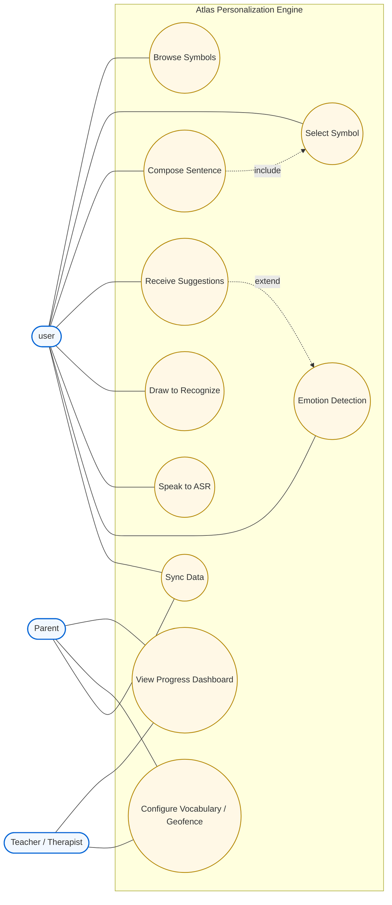

# Use Case Diagram

```mermaid
graph LR

  %% =========================
  %% Actors
  %% =========================

  S([user])
  P([Parent])
  TT([Teacher / Therapist])

  %% =========================
  %% System Boundary
  %% =========================

  subgraph Atlas["Atlas Personalization Engine"]

    BS((Browse Symbols))
    SS((Select Symbol))
    CS((Compose Sentence))
    RS((Receive Suggestions))

    DR((Draw to Recognize))
    SA((Speak to ASR))
    ED((Emotion Detection))
    SY((Sync Data))

    PD((View Progress Dashboard))
    CV((Configure Vocabulary / Geofence))

  end

  %% =========================
  %% Actor Associations
  %% =========================

  S --- BS
  S --- SS
  S --- CS
  S --- RS
  S --- DR
  S --- SA
  S --- ED
  S --- SY

  P --- PD
  P --- CV
  P --- SY

  TT --- PD
  TT --- CV

  %% =========================
  %% Include / Extend
  %% =========================

  CS -.->|"include"| SS
  RS -.->|"extend"| ED

  %% =========================
  %% Styling
  %% =========================

  classDef actor fill:#f2f8ff,stroke:#0366d6,stroke-width:2px;
  classDef usecase fill:#fff8e6,stroke:#b58900,stroke-width:1.5px;

  class S,P,TT actor;
  class BS,SS,CS,RS,DR,SA,ED,SY,PD,CV usecase;
```

