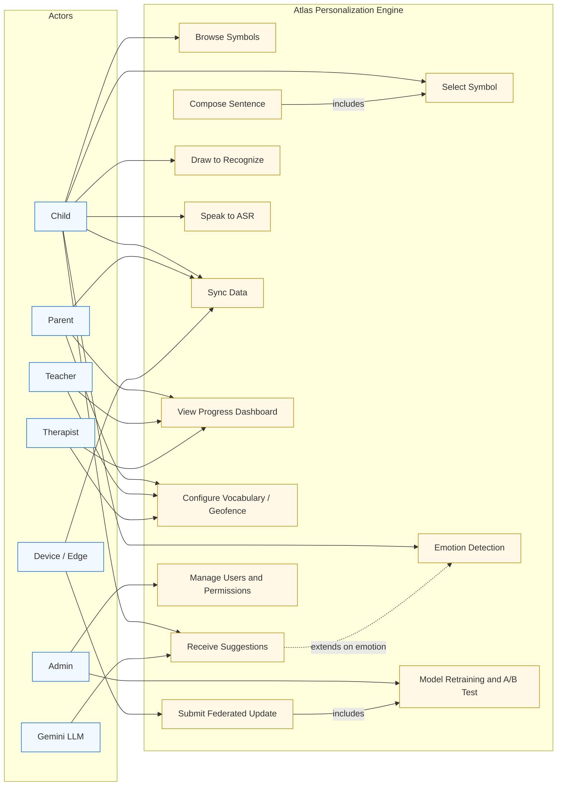

# Use Case Diagram

```mermaid
graph LR

  %% Actors
  subgraph Actors["Actors"]
    C["Child"]
    P["Parent"]
    T["Teacher"]
    R["Therapist"]
    A["Admin"]
    D["Device / Edge"]
    L["Gemini LLM"]
  end

  %% System boundary with use cases
  subgraph Atlas["Atlas Personalization Engine"]
    BS["Browse Symbols"]
    SS["Select Symbol"]
    CS["Compose Sentence"]
    RS["Receive Suggestions"]
    DR["Draw to Recognize"]
    SA["Speak to ASR"]
    ED["Emotion Detection"]
    SY["Sync Data"]
    PD["View Progress Dashboard"]
    CV["Configure Vocabulary / Geofence"]
    FU["Submit Federated Update"]
    MR["Model Retraining and A/B Test"]
    MU["Manage Users and Permissions"]
  end

  %% Actor to Use Case links
  C --> BS
  C --> SS
  C --> RS
  C --> DR
  C --> SA
  C --> ED
  C --> SY

  P --> PD
  P --> CV
  P --> SY

  T --> PD
  T --> CV

  R --> PD
  R --> CV

  D --> FU
  D --> SY

  A --> MU
  A --> MR

  L --> RS

  %% Include / Extend relationships
  CS -->|"includes"| SS
  RS -.->|"extends on emotion"| ED
  FU -->|"includes"| MR

  %% Styling
  classDef actor fill:#f2f8ff,stroke:#0366d6,stroke-width:1px;
  classDef system fill:#fff8e6,stroke:#b58900,stroke-width:1px;

  class C,P,T,R,A,D,L actor;
  class BS,SS,CS,RS,DR,SA,ED,SY,PD,CV,FU,MR,MU system;
```
